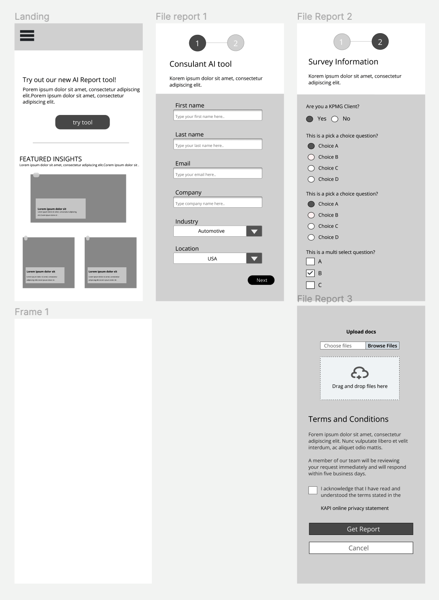
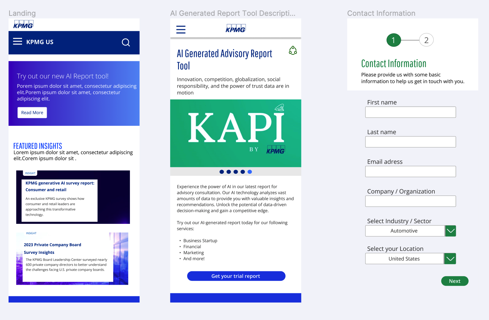
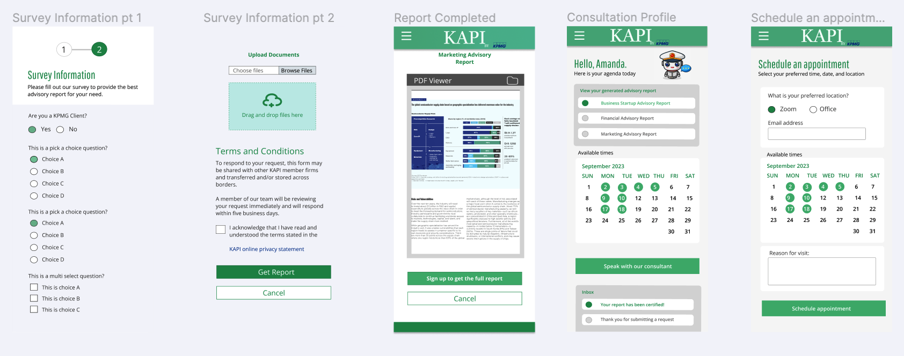

# KAPI (Mock) <!-- omit in toc -->

> Software solution aimed to reduce the complexity behind the advisory services within the company.

## Table of Contents <!-- omit in toc -->

- [Problem Statement](#problem-statement)
- [Proposed Solution](#proposed-solution)
  - [Features](#features)
- [Tech Stack](#tech-stack)
- [Usage (Local)](#usage-local)
- [Wireframes](#wireframes)
  - [Low Fidelity](#low-fidelity)
  - [Medium Fidelity](#medium-fidelity)
- [License](#license)

## Problem Statement

A company has hired you to propose creative and strategic solutions for how they can effectively utilize Generative AI to improve customer engagement to drive innovation and efficiency.

## Proposed Solution

Develop a Web App to allow users to request a quick Advisor Report generated by a GenAI model. Users will have the ability to receive a FREE report while having the opportunity to request a full certified report within 24 hours.

### Features

1. Users can sign up for a _FREE_ KAPI report through a form
   1. Users can **upload a PDF** containing their data to be analyzed
2. Users are able to visit the different services offered by KPMG
3. The Web App is **fully responsive** on both mobile and desktop devices increasing reach and availability
4. The app is **screen reader-friendly** and follows the latest WAR-ARIA standards of **accessibility**
5. Users can **sign up for a newsletter** offered by KPMG to stay engaged with the latest news and updates
6. Users can experience the **latest Featured Insights** served by KPMG helping them find relevant news

## Tech Stack

- **Framework:** React.js
- **Language**: TypeScript
- **Styling:** TailwindCSS, DaisyUI
- **UI Design:** Figma

## Usage (Local)

1. Install Dependencies: `npm install`
2. Run the application: `npm run dev`

## Wireframes

> **By:** Coral, Mareline

### Low Fidelity

### Medium Fidelity

## License

Copyright 2023 HSI Battle of the Brains FIU Team, Sebastian, Paola, Coral, Jimmy, Ishel, Federico, Naween, Mereline

Licensed under the Apache License, Version 2.0 (the "License"); you may not use this file except in compliance with the License. You may obtain a copy of the License at

> <http://www.apache.org/licenses/LICENSE-2.0>

Unless required by applicable law or agreed to in writing, software distributed under the License is distributed on an "AS IS" BASIS, WITHOUT WARRANTIES OR CONDITIONS OF ANY KIND, either express or implied. See the License for the specific language governing permissions and limitations under the License.
